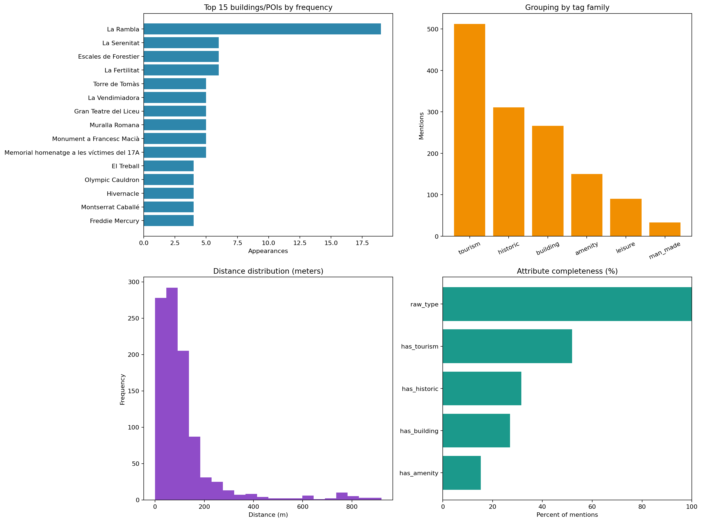
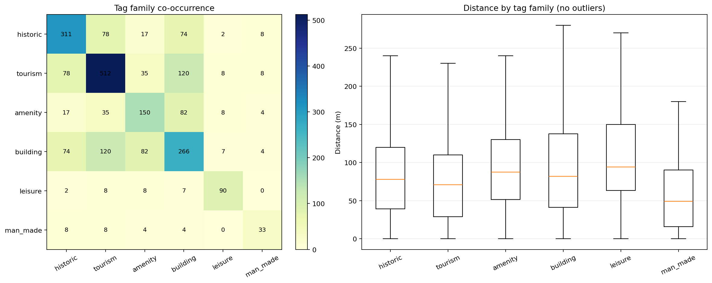
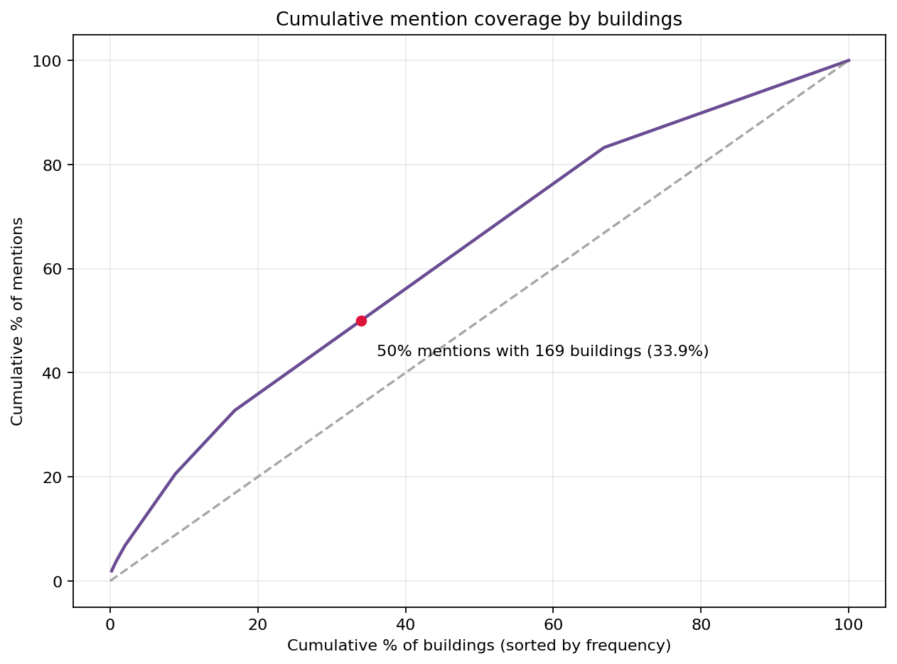

# Experimentos de ML - LandmarkLens

Este documento resume la experimentación de Machine Learning realizada con el conjunto de datos JSON actual del repositorio, con foco en reproducibilidad, trazabilidad y lectura clara.

## 1) Conjunto de datos

### 1.1 Origen de los datos

- Fuente principal: landmarks de OpenStreetMap y contexto de POIs cercanos generado por el pipeline de LandmarkLens.
- Archivo utilizado: `ML/data/training_examples.json`.
- Hash de trazabilidad (SHA-256): `eb120561d70b885967c6dd9a957a0a47a0a553f119f6857baa77c4b0c23ef4fa`.

### 1.2 Número de muestras

| Elemento | Valor |
|---|---:|
| Muestras crudas | 200 |
| Muestras válidas tras limpieza | 200 |
| Entrenamiento | 160 |
| Validación | 20 |
| Test | 20 |

### 1.3 Características principales

Campos base por muestra:

- `prompt`: consulta en lenguaje natural con coordenadas GPS.
- `response`: respuesta esperada con landmarks ordenados por relevancia.

Campos derivados en preprocesamiento:

- `latitude`, `longitude`.
- `candidate_count`.
- `contains_untitled`.
- `contains_probability_phrase`.

Cobertura geográfica detectada:

- Latitud: `41.094218` a `42.681410`
- Longitud: `0.640883` a `3.286009`

## 2) Preprocesamiento

Script: `ML/scripts/prepare_data.py`

### 2.1 Limpieza

1. Normalización de texto (saltos de línea y espacios finales).
2. Eliminación de filas con prompt/respuesta vacíos.
3. Eliminación de duplicados exactos por `(prompt, response)`.
4. Extracción de coordenadas y número de candidatos.

### 2.2 Transformaciones

- Partición determinista `80/10/10` con semilla `42`.
- Exportación a JSONL:
  - `ML/data/processed/train.jsonl`
  - `ML/data/processed/val.jsonl`
  - `ML/data/processed/test.jsonl`
- Estadísticas en:
  - `ML/data/processed/dataset_stats.json`

## 3) Experimentos

### E1. Perfilado del conjunto de datos y línea base de calidad

- Script: `ML/scripts/prepare_data.py`
- Objetivo: validar integridad y generar particiones reproducibles.
- Configuración:
  - entrada: `ML/data/training_examples.json`
  - salida: `ML/data/processed`
  - semilla: `42`

| Métrica | Valor |
|---|---:|
| Muestras crudas | 200 |
| Muestras limpias | 200 |
| Vacías descartadas | 0 |
| Duplicados descartados | 0 |
| Media de candidatos por muestra | 4.99 |
| Muestras con `untitled` | 2 |
| Muestras con frase de probabilidad | 194 |

### E2. Generación de artefactos de modelo

- Script: `ML/scripts/train_model.py`
- Objetivo: generar el primer artefacto de modelo y su configuración de entrenamiento.
- Configuración:
  - modelo base: `llama3.2:3b`
  - nombre del modelo: `landmark-finder-v1`
  - parámetros de inferencia:
    - `temperature=0.1`
    - `top_p=0.9`
    - `num_ctx=8192`
    - `num_predict=512`

Artefactos generados:

- `ML/models/landmark-finder-v1/Modelfile`
- `ML/models/landmark-finder-v1/training_config.json`
- `ML/models/landmark-finder-v1/model_build_result.json`

### E3. Evaluación estructural en test

- Script: `ML/scripts/evaluate_model.py`
- Objetivo: verificar calidad estructural en la partición de test.
- Configuración:
  - entrada: `ML/data/processed/test.jsonl`
  - salida: `ML/experiments/evaluation_report.json`

| Métrica | Valor |
|---|---:|
| Muestras de test | 20 |
| Tasa de muestras con 5 candidatos | 1.00 |
| Tasa de muestras con coordenadas | 1.00 |
| Tasa de frase de probabilidad | 1.00 |
| Tasa de `untitled` | 0.05 |
| Media de candidatos | 5.00 |

### E4. Evaluación de inferencia en línea con Ollama

- Script: `ML/scripts/evaluate_online_ollama.py`
- Objetivo: medir calidad de salida y latencia en inferencia real.
- Configuración:
  - modelo: `landmark-finder-e4` (base `qwen2.5:7b`)
  - entrada: `ML/data/processed/test.jsonl`
  - muestras solicitadas: `20`
  - timeout por muestra: `60s`
  - salida: `ML/experiments/online_eval_report.json`

| Métrica | Valor |
|---|---:|
| Muestras solicitadas | 20 |
| Muestras ejecutadas correctamente | 19 |
| Tasa de JSON válido | 0.9474 |
| Tasa de predicciones dentro de candidatos | 0.8947 |
| Tasa de predicciones no vacías | 0.9474 |
| Latencia media (ms) | 5408.58 |

Incidencias observadas:

- 1 muestra superó el timeout de 60 segundos.
- 1 salida JSON incluyó un campo numérico mal formado (`distance:79` sin comillas).
- 1 respuesta incluyó un error tipográfico en nombre de entidad.

## 4) Comparación de resultados

| Métrica | E1 (conjunto de datos limpio completo) | E3 (test) | E4 (inferencia en línea) |
|---|---:|---:|---:|
| Media de candidatos por muestra | 4.99 | 5.00 | 5.00 (candidatos de entrada) |
| Tasa de frase de probabilidad | 0.97 | 1.00 | no aplica |
| Tasa de `untitled` | 0.01 | 0.05 | 0.00 en predicciones |
| Tasa de JSON válido | no aplica | no aplica | 0.9474 |
| Tasa de predicciones restringidas a candidatos | no aplica | no aplica | 0.8947 |
| Latencia media (ms) | no aplica | no aplica | 5408.58 |

## 5) Análisis visual del conjunto de datos crudo

El análisis visual está en `ML/experiments/LandmarkLens_Examples.ipynb` (secciones 15 y 16) sobre `ML/data/training_examples.json`.

### 5.1 Gráficos incluidos

| Gráfico | Qué aporta |
|---|---|
| Top 15 edificios/POIs por frecuencia | Detecta entidades dominantes y repetición. |
| Agrupación por familia de tags | Mide composición temática (`tourism`, `historic`, etc.). |
| Histograma de distancias | Describe el rango de proximidad de landmarks. |
| Completitud de atributos (%) | Evalúa disponibilidad de metadatos por mención. |
| Distribución de direcciones | Valida balance direccional para escenarios con azimut. |
| Distancia mediana por posición (top-k) | Comprueba coherencia de ranking por cercanía. |
| Co-ocurrencia de tags | Detecta solapamientos semánticos entre categorías. |
| Boxplots de distancia por tag | Compara dispersión y mediana por familia de tag. |
| Curva long-tail acumulada | Mide concentración de menciones vs diversidad. |

### 5.2 Hallazgos clave

| Hallazgo | Valor |
|---|---:|
| Muestras crudas | 200 |
| Menciones parseadas | 986 |
| Edificios únicos | 498 |
| Media de menciones por muestra | 4.93 |
| Distancia media (m) | 112.24 |
| Distancia mediana (m) | 80.00 |

Agregación por familia de tag:

| Familia de tag | Menciones |
|---|---:|
| `tourism` | 512 |
| `historic` | 311 |
| `building` | 266 |
| `amenity` | 150 |
| `leisure` | 90 |
| `man_made` | 33 |

Concentración long-tail:

- El 50% de las menciones se cubre con 169 edificios.
- Eso representa el 33.94% del total de edificios únicos (498).

Interpretación resumida:

- El conjunto de datos presenta concentración moderada: existe una cabeza relevante, pero conserva cobertura en cola.
- `tourism` y `historic` dominan el perfil semántico.
- La distancia mediana aumenta con la posición del ranking, coherente con ordenación por cercanía.

### 5.3 Galería de figuras (PNG exportados)

Las imágenes se exportan en `ML/experiments/figures/` y pueden usarse directamente en informes.

#### Vista general de datos crudos



#### Co-ocurrencia y dispersión de distancias



#### Curva de concentración long-tail



## 6) Reproducibilidad

Pipeline completo:

```bash
python ML/scripts/pipeline.py
```

Evaluación en línea con Ollama:

```bash
python ML/scripts/evaluate_online_ollama.py --model landmark-finder-e4 --max-samples 20
```

Exportación de figuras EDA:

```bash
python ML/experiments/export_eda_figures.py
```

## 7) Limitaciones y próximos pasos

- Ampliar el conjunto de datos con más regiones y casos límite.
- Corregir automáticamente respuestas con `untitled` en curación de datos.
- Añadir reintentos y reparación de JSON en evaluación en línea.
- Mantener evaluación periódica sobre modelos alternativos de Ollama.
